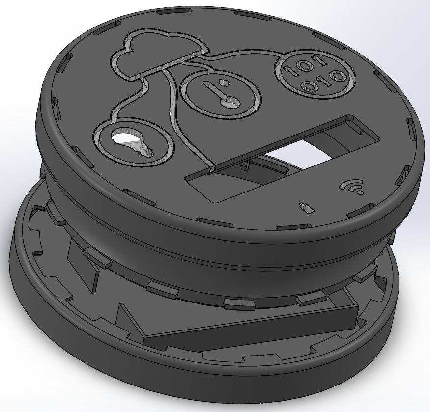
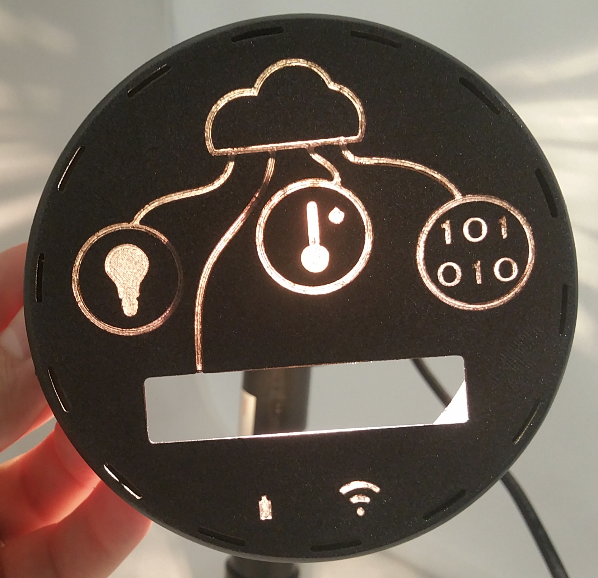
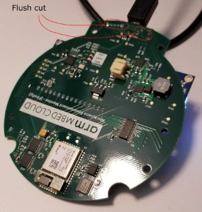
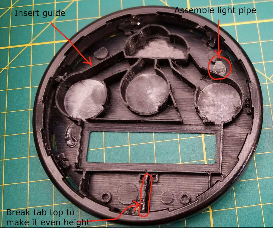
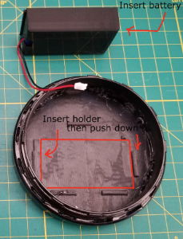
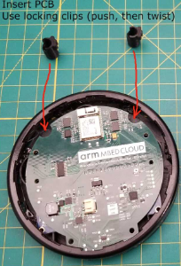

# Workplace Environmental Monitor Enclosure

This document contains information about the Workplace Environmental Monitor's:

- CAD - mechanical CAD and related files for the enclosure.
- Datasheets - component datasheets.
- PCB - PCB design files and outputs.

We provide these files under the Solderpad License v0.51.

We accept contributions to this project under the same license.

### Enclosure

Description: The PCB is a single board design. Test points are present for future test fixture and factory provisioning purposes. Enclosure parts are modular for more versatility and for less expensive and better printing. The locking mechanism is on the top half to allow inserting the PCB at assembly time. Enclosure parts include an exposed micro-USB connector, a sliding power switch, a charging LED and a button, all on the upper rim of the enclosure. Only the battery uses the bottom side of the enclosure. The light sensor has its own window to maximize response to environment changes. The temperature and humidity sensor is in a thermal relief area on the PCB and positioned directly under an air vent to make readings more accurate and more responsive. Light pipes join together to facilitate future press fit manufacturing. The enclosure uses locking clips and clamps throughout to eliminate the need for hot gluing during assembly.

#### Manufacturing choices

Due to the fact that the top part of the enclosure has built-in light channels, manufacturing choices are split in two categories. The first manufacturing choice is to print the top without light channels and adding them in-house, either through translucent material pouring (for example, epoxy or silicone gel) or through press-fitting acrylic cut parts. Both variants are difficult and are likely to yield low-quality results (for example, uneven surfaces or gaps). The second manufacturing choice is to print the top with a dual material process. This is the recommended action, even though it comes with a severe limitation in manufacturing processes. Only FDM and PolyJet can embed translucent material into a part. Of the two, FDM is the most cost effective, and PolyJet is the better looking. The exact difference in unfinished quality varies with the manufacturer. The recommended course of action is to get one unit with each of the two processes, and choose one to move forward with based on visual inspection.

#### Finishing choices

For our in-house production, we have used manual sanding and painting for the best results. Manufacturing houses all want to avoid this because of the high and nonscalable cost. Some houses offer automatic sanding and some mention the ability to paint, but without specific pricing. The recommendation is to manufacture the parts with no finish or with only automatic sanding, and determine whether the outcome is satisfactory.

#### Rendered images

#### Finished look

### Bringup

1. Plug in the board. Make sure it enumerates as `CRP DISABLD`. On a Mac, this is under `/Volumes`.
1. Run this command: `rm /Volumes/CRP\ DISABLD/*; cp -X lpc11u35_mbed_cloud_connect_if_crc.bin /Volumes/CRP\ DISABLD/`
1. Wait for DAPLink to be flashed (depending on your machine, between 7 and ~70 seconds).
1. Turn the board off and then back on. Make sure it now enumerates as `DAPLINK`. If it still enumerates as before, you didn't wait long enough - go back to step 2.
1. Hold the reset button down. While keeping it down, run this command: `touch /Volumes/DAPLINK/auto_rst.cfg`
1. Let go of the reset button. 
1. Wait for the board to reboot.
1. Flash the firmware.

### Assembly

1. Flush cut the leads at the edge of the PCB, so they fit under the enclosure rim. 
    
1. Sand the light pipes to make them diffuse.
1. Fill out the inside of the cloud icon with black marker or paint to prevent the LED from shining through. Make sure you do not cross the cloud edge (where the light pipe is).
1. Remove the left half of the bottom clip to help the PCB go in easier. 
    
1. Assemble the top plate with the upper ring, so the USB hole is at the bottom (below the LCD cutout). Push the pins down gently with a tool. Don't push the ring itself, or the pins could break. Make sure the plate is flush with the ring and no gaps are showing. Optionally, hot glue the pins in place to provide more durability.
1. Insert light guides (don't glue them), and adjust the top of the marked tab to be an even height.
1. Using a dab of glue (hot glue), put the tiny cylindrical light pipe in. 
  
1. Assemble the bottom plate with the lower ring the same way as you assembled the top plate in step 5.
1. Place the battery in the battery holder, and assemble the holder onto the bottom plate. 
  
1. Remove the LCD's protective sheet, and insert the PCB into the top half of the enclosure. This is the trickiest step because the fit is tight. Align the connectors to the holes first, and then slide the PCB in and seat it into the guide. You have correctly inserted the PCB when there is no space between the LCD and the top plate of the enclosure. If possible, avoid putting fingerprints on the LCD.
1. Insert the two round PCB clips, and twist each of them 90 degrees clockwise to lock the PCB in place. 
  
1. Connect the battery to the PCB, and twist the lock the two enclosure halves. Test the basic functions, and ship it. 
  

#### LED order

|1|2|3|4|5|6|7|
|-|-|-|-|-|-|-|
|Power|Wi-fi|Cloud|Update/FOTA|Light sensor|Temperature and humidity sensor|LCD and future sound sensor

#### LED color state matrix

|LED name|In progress|Good|Bad|
|-|-|-|-|
|Power|Blink green|Green|Red
|Wi-Fi|Blink yellow|Blue|Red
|Cloud|Blink yellow|Blue|Red
|Firmware update (download in progress)|Blink yellow|Blue (on download completion)|Red
|Firmware update (perform verifications and write to flash)|Blue|Off (on flash completion, system rebooted) |Red
